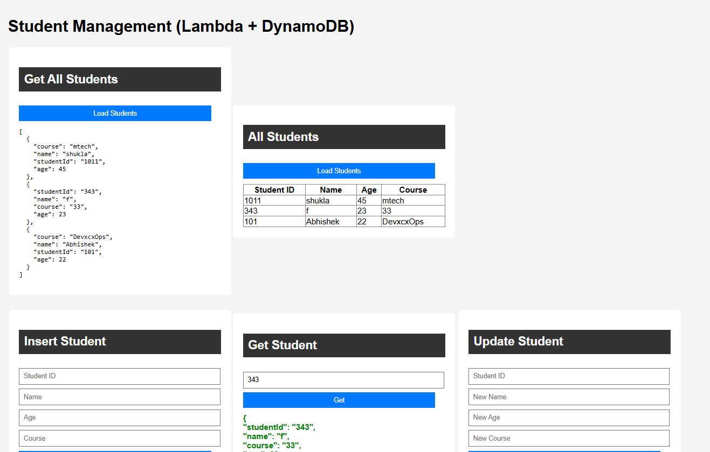
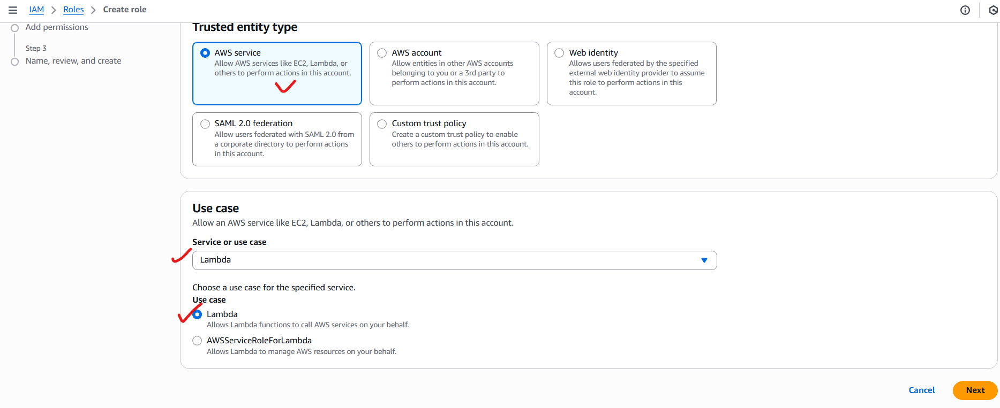
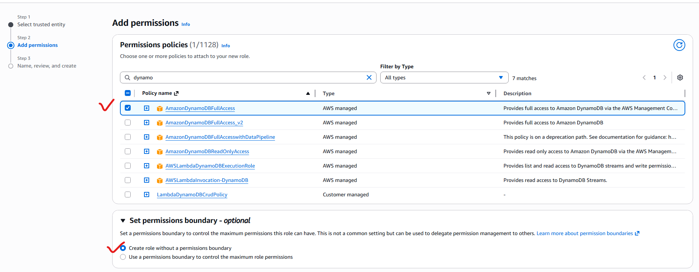
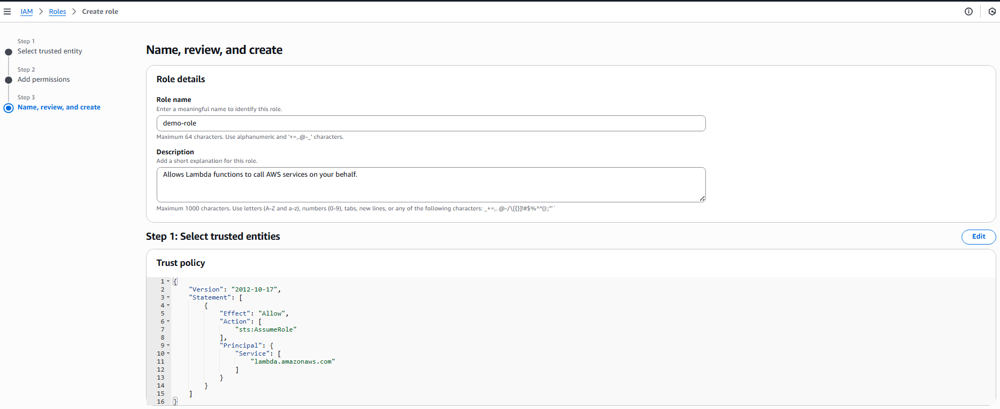
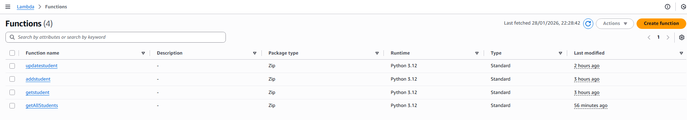
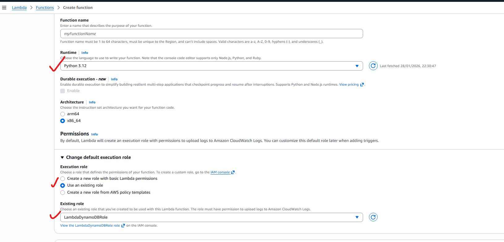
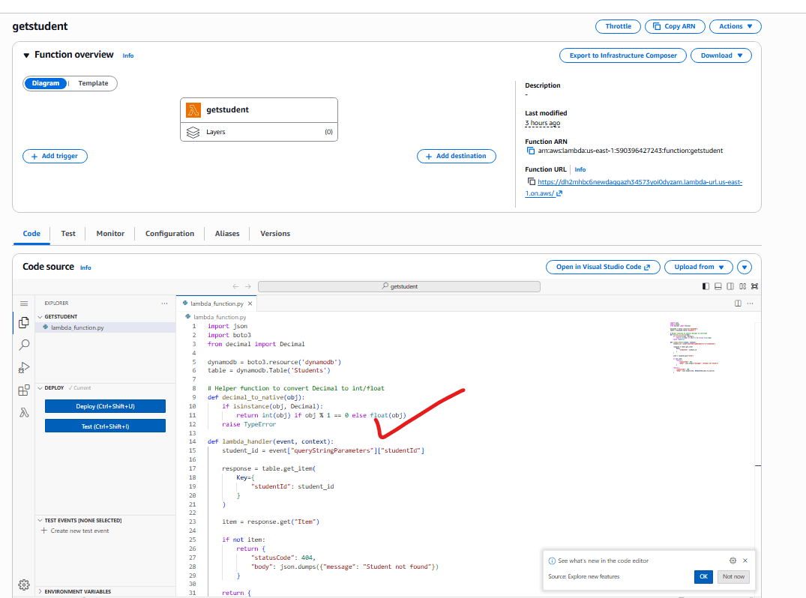
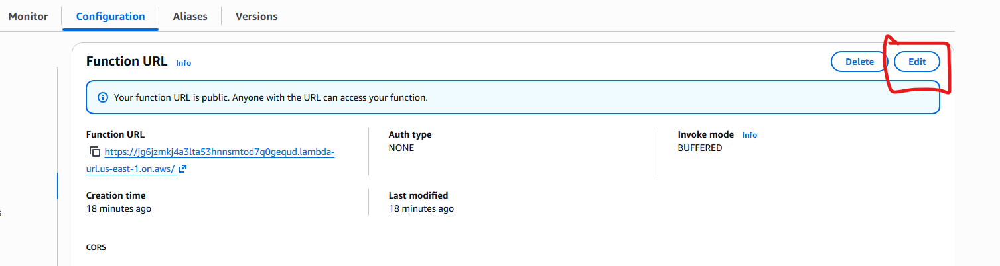
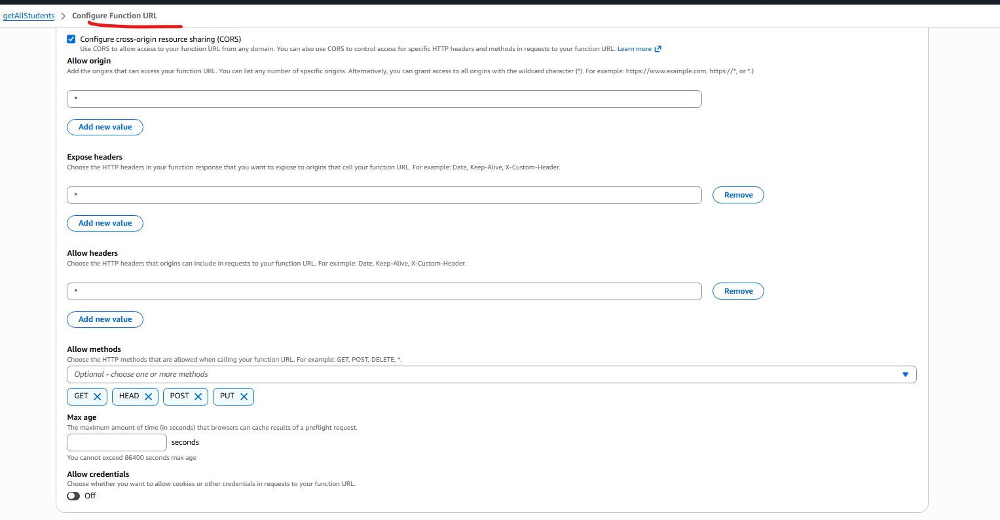
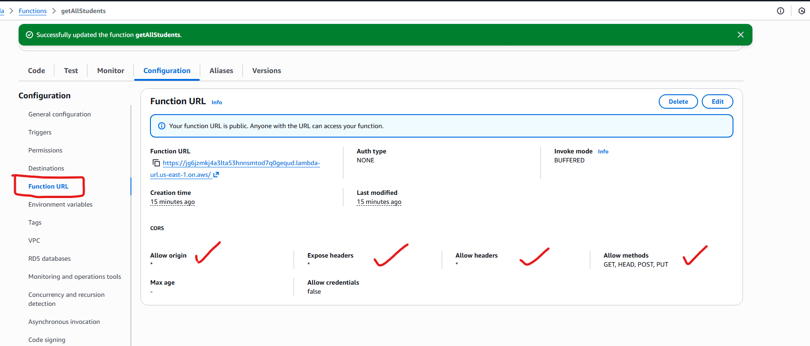

# Dynamodb CRUD-Micro services(Lambda)

# What we are going to build 




## Lets Create a AWS DynamoDB Table

```html
STEP 1 — Create DynamoDB Table

Open DynamoDB → Tables → Create table

Table name: Students

Partition key:

Name: studentId

Type: String

Leave defaults → Create table


```


## STEP 2 — Create IAM Role for Lambda







Create the role. This role will be assigned during creation of lambda functions.

## Create Lambda Functions as micro services

Lets create 4 lamda functions, we will use above created IAM role.






you can use the code from the repo.


## To Enable the communication
from this static page to our lambda functions, we need to change the configuration in every lambda function.






After changing , it should look like this



Finally our application looks like 


# Lets Expose these lambda by AWS API Gateway
